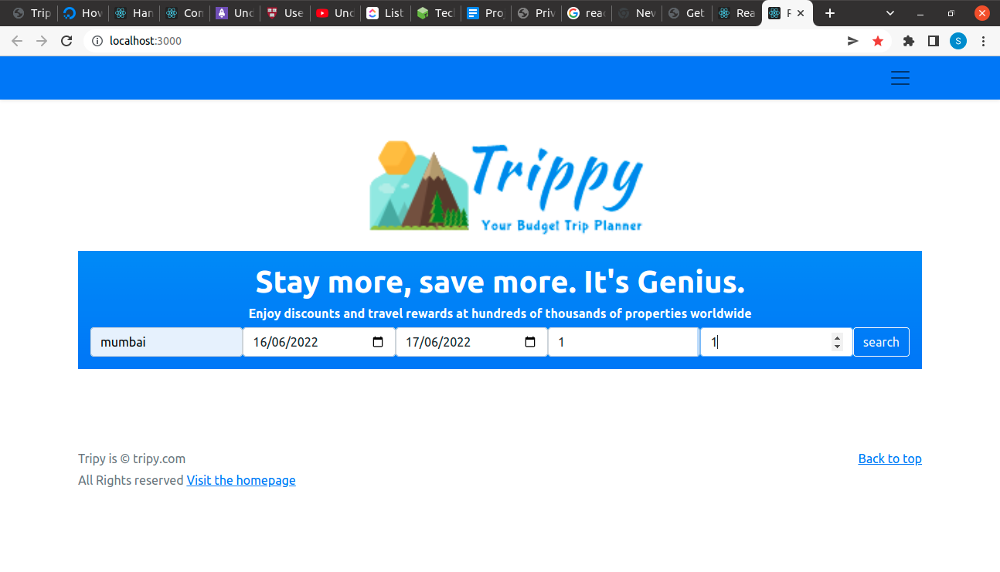
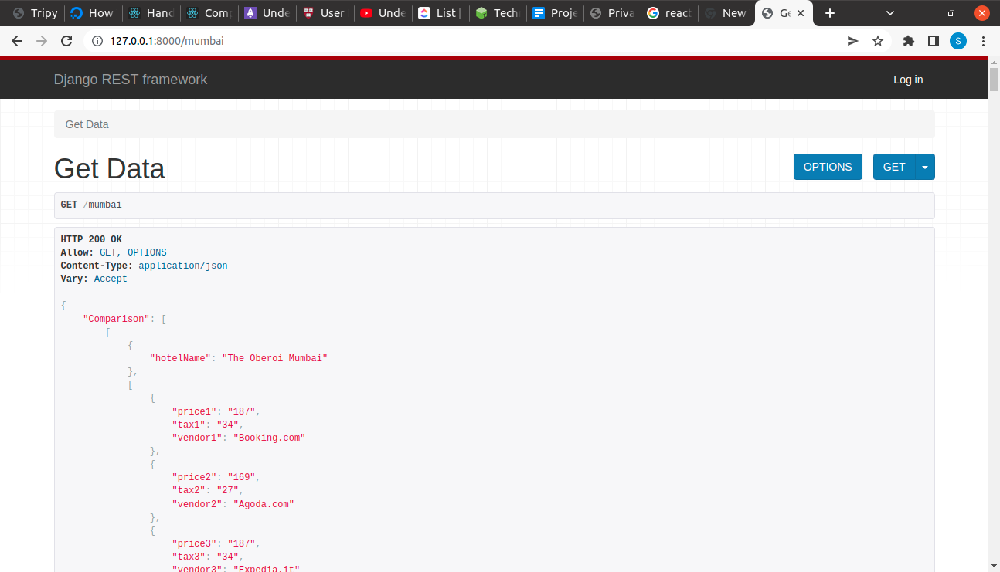

# Trippy

Trippy is a Real Time Web Application which allows us to Search for Lowest Prices offered by Hotels of desired cities. It Allows Users to Compare Prices of Hotels Across various OTA Platforms and Choose the one with the lowest price offered


## Hotel API 

Register here for Hotels API key

[makcorps.com](https://www.makcorps.com)


## API Reference

#### Get Hotels

```http
  GET /api/${destination}
```

| Parameter | Type     | Description                       |
| :-------- | :------- | :-------------------------------- |
| `destination`      | `string` | **Required**. destination name |


## Environment Variables

To run this project, you will need to add the following environment variables to your .env file

`API_USERNAME`

`API_PASSWORD`

`SECRET_KEY`


## FAQ

#### What is API_USERNAME ?

It is a username that is provided when you register with the hotel api

#### What is API_PASSWORD ?
It is a password that is provided when you register with the hotel api


## Screenshots





